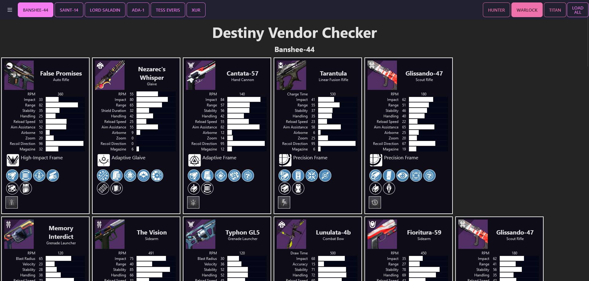

# Destiny Vendor Checker


Provide config files:

`server/config/authorization.json`:

```JSON
{
  "authorization": {
    "accessToken": {
      "value": "_",
      "expires": 3600,
      "name": "access",
      "inception": 1689037226538
    },
    "refreshToken": {
      "value": "_",
      "expires": 7776000,
      "name": "refresh",
      "inception": 1689037226538
    },
    "bungieMembershipId": "_"
  }
}
```

`server/config.default.cjs`:

```Typescript
let config = {
  "api_key": "_",
  "client_id": "_",
  "client_secret": "_",
}
module.exports = config;
```

To run:

1. `npm start` in `./client`
2. `npm start` in `./server`

Todo: better setup for config, allow authentication in browser.

